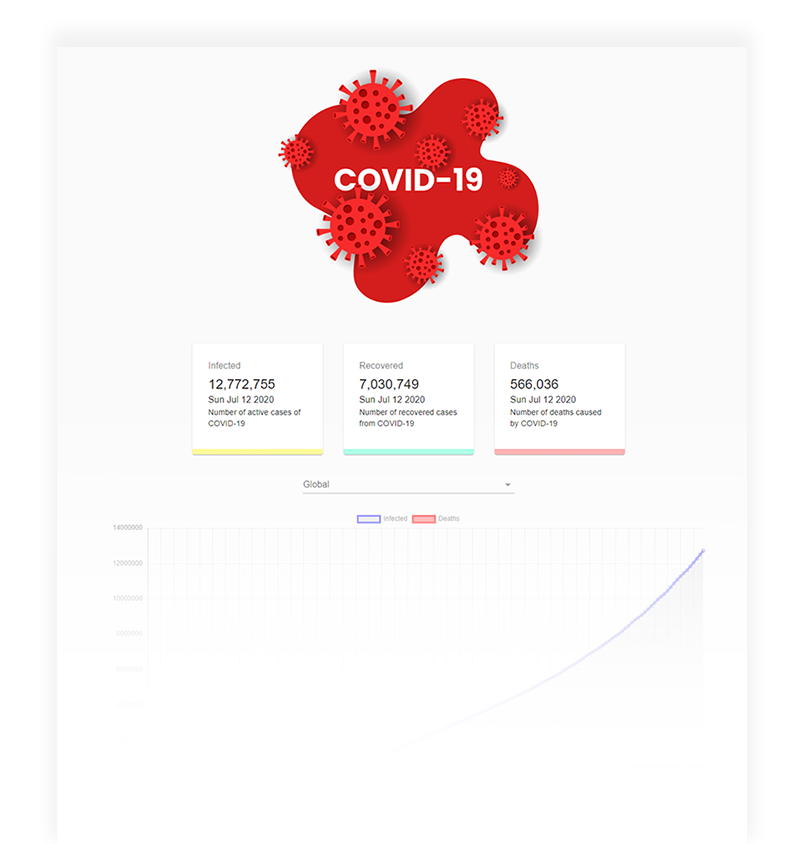

<h1 align="center">React Covid-19 Live Tracker App</h1>

## General info

Covid-19 live tracker is a tool where you can see live update about Corona virus cases which affects throughout the world in three sections such as **infected**, **recovered** and **deaths**.  

#### [Live Site](https://sunil-pradhan.github.io/react-Covid-19-live-tracker-app/)

## Screenshots

 

  

## Technologies used
* React
* Charts.JS
* Material UI
* API used: https://covid19.mathdro.id/api

## Functionalities

* Track live status – infected, recovered and deaths 
* Do a filter by country 
* Show live data via bar and line chart  

## License

This project is licensed under the MIT License. 